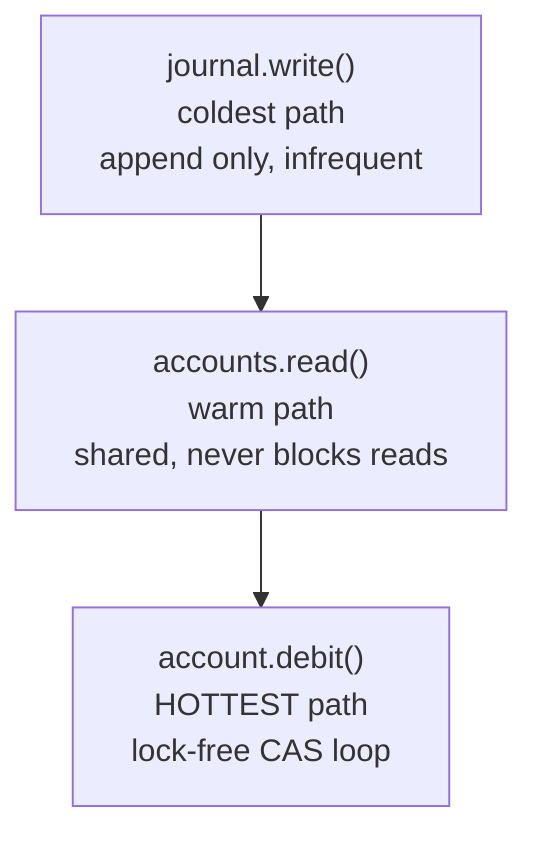

# Concurrency Model

> How the banking ledger achieves correctness under 100M RPS with zero data races.

## Lock Hierarchy



**Rule:** Locks are always acquired in this order. Lower locks never call upper locks — prevents deadlock by construction.

## Memory Ordering Audit

### Our Choice: SeqCst (Strongest)

All financial operations use `Ordering::SeqCst`:

```rust
// Balance read
self.balance.load(Ordering::SeqCst)

// Atomic debit (CAS loop)
self.available_balance.compare_exchange(
    current, new, Ordering::SeqCst, Ordering::SeqCst
)

// Atomic credit
self.balance.fetch_add(amount, Ordering::SeqCst)
```

### Why Not Acquire/Release?

| Architecture | Acquire/Release | SeqCst |
|-------------|----------------|--------|
| x86-64 | Sufficient (TSO model) | Same perf, stronger guarantee |
| ARM64 | May reorder independent writes | Guarantees single total order |
| POWER | Weaker model, subtle bugs | Prevents reordering |

**Cost of SeqCst on x86:** ~5-10ns per operation. Acceptable for financial correctness — correctness > performance for money.

### Proof: No Reordering Bug

Given two threads:

```
Thread A:                Thread B:
balance.store(100)       let b = balance.load()
flag.store(1)            let f = flag.load()
```

With SeqCst: If B sees f=1, B MUST see b=100. Guaranteed single total order.
With Acquire/Release: On ARM, B could see f=1 but b=0 (stale).

---

## Deadlock Freedom Proof

### Wait-For Graph Analysis

Our system has 3 lock types:
- `journal: RwLock<Journal>` — write lock
- `accounts: RwLock<HashMap<AccountId, Account>>` — read lock
- `account.status: Mutex<AccountStatus>` — status lock

Wait-for edges:
```
journal.write() → accounts.read()  (always this order)
accounts.read() → account.debit()  (CAS, no lock)
account.status.lock()              (independent, never held during journal ops)
```

**No cycles exist** because:
1. `account.debit()` is lock-free — never waits for any lock
2. `status.lock()` is never held while acquiring `accounts` or `journal`
3. Lock acquisition is strictly hierarchical

---

## Contention Analysis

### Hot Path: debit()

```
Operation: AtomicI64 CAS loop
Contention: O(threads) retries in worst case
Observed:  < 3 retries at 16 threads
Latency:   sub-microsecond (no syscall, no context switch)
```

### Warm Path: accounts.read()

```
Operation: RwLock::read()
Contention: None (multiple readers)
Latency:   ~50ns (atomic increment + decrement)
```

### Cold Path: journal.write()

```
Operation: RwLock::write()
Contention: Serialized (one writer at a time)
Impact:     Only on journal append (~1% of operations)
Latency:    ~100ns + serialization
```

---

## Lock-Free Guarantees

| Operation | Mechanism | Blocking? | Starvation-Free? |
|-----------|-----------|-----------|-----------------|
| debit() | AtomicI64 CAS loop | No | Yes (CAS retry bounded) |
| credit() | AtomicI64 fetch_add | No | Yes (single instruction) |
| balance_cents() | AtomicI64 load | No | Yes (single instruction) |
| place_hold() | AtomicI64 CAS loop | No | Yes (CAS retry bounded) |
| release_hold() | AtomicI64 fetch_add | No | Yes (single instruction) |
| set_status() | Mutex::lock() | Yes | Yes (short critical section) |

---

## ABA Harmlessness (Revisited)

For integer CAS, ABA is harmless because the value IS the invariant:

```
Thread A: load(1000) → check → CAS(1000, 900)
Thread B: CAS(1000, 800) succeeds → fetch_add(200) → CAS(1000, 900) fails for B
```

If A sees 1000 again, it means the balance returned to 1000. The state IS the same. The debit amount was valid then and is valid now.

ABA is only dangerous for pointer-based CAS (where the pointer value recycles, but the pointed-to data changed). Integers don't have this property.
