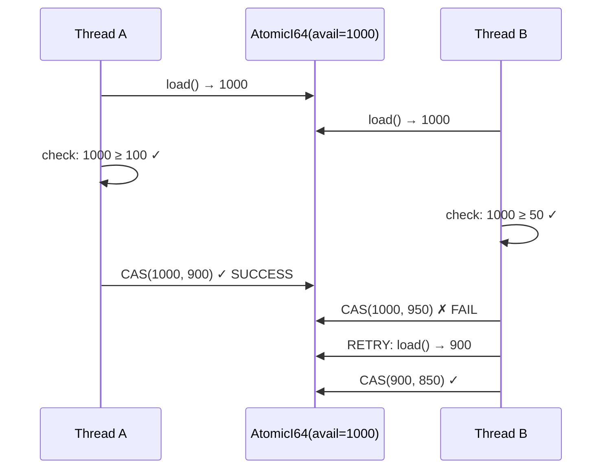

# Financial Correctness Model

> How the banking ledger guarantees that 0.0001 never goes missing.

## Core Invariants

### I1: Double-Entry Balance
```
∀ journal_entry ∈ Journal:
  Σ(debits) ≡ Σ(credits)
```
Every journal entry MUST balance. If debits ≠ credits, the entry is rejected at creation time. Once committed, the invariant is permanently true.

### I2: Balance Conservation
```
∀ account ∈ Accounts:
  balance = initial_balance + Σ(credits) - Σ(debits)
```
An account's balance is always derivable from its transaction history. The CAS-based direct update is an optimization — the event log is the source of truth.

### I3: Available ≤ Balance
```
∀ account ∈ Accounts:
  available_balance ≤ balance
```
Available balance (what can actually be spent) never exceeds the actual balance. Holds reduce available but not balance.

### I4: No Negative Available
```
∀ account ∈ Accounts:
  available_balance ≥ 0
```
Debits check available_balance, not balance. A debit that would make available negative is rejected.

### I5: Immutable Journal
```
∀ entry ∈ Journal:
  once written, entry.legs[i].amount_cents never changes
```
Journal entries are append-only. Corrections are new offsetting entries (reversals), not modifications.

---

## Decimal Precision

### Why Not f64?

Binary floating point (IEEE 754) cannot represent 0.1 exactly:

```
f64: 0.1 + 0.2 = 0.30000000000000004  ← WRONG
Decimal: 0.1 + 0.2 = 0.3              ← CORRECT
```

Over millions of transactions, f64 errors compound into real money loss.

### rust_decimal

| Property | Value |
|----------|-------|
| Mantissa | 96-bit integer |
| Max precision | 28 decimal places |
| Representation | sign × mantissa × 10^(-scale) |
| Zero representation | exact |

### Rounding Mode Default: HalfEven (Banker's Rounding)

```
1.005 → 1.00 (round to even)
2.005 → 2.01 (round to even)
1.015 → 1.02 (round to even)
```

Banker's rounding minimizes cumulative bias over millions of transactions. Symmetric: rounds up and down equally.

### Currency-Specific Scaling

| Currency | Minor Unit | Subunits/Unit | Example |
|----------|-----------|---------------|---------|
| USD, EUR | 2 | 100 | $1.00 = 100 cents |
| JPY | 0 | 1 | ¥100 = 100 |
| VND | 0 | 1 | 50,000₫ = 50000 |
| BTC | 8 | 100,000,000 | 1 BTC = 100,000,000 satoshis |

---

## Atomicity Guarantees

### CAS Loop Correctness



**Proof:** Each CAS either succeeds (atomically updating the value) or fails (another thread won). On failure, the loop retries with the fresh value. The loop is bounded because:
1. Each iteration is O(1)
2. Contention decreases exponentially (fewer threads competing)
3. In practice, < 3 retries typical even under heavy load

### ABA Freedom

**Claim:** The CAS loop is immune to the ABA problem for integer balances.

**Proof:** The ABA problem occurs when:
1. Thread A reads value X
2. Thread B changes X → Y → X
3. Thread A's CAS(X, Z) succeeds

For integer balances, this is NOT a bug because:
- The value X represents the actual balance
- If the balance returned to X, the system state IS the same
- The debit amount was valid at both time points
- No implicit invariant was violated

ABA is only dangerous when the value encodes pointer identity (which integers don't).

---

## Overflow Handling

### Current Behavior

| Operation | Debug Mode | Release Mode |
|-----------|-----------|--------------|
| credit(i64::MAX) | panic (overflow) | wrap (2's complement) |
| debit(i64::MAX) from 0 | checked (InsufficientFunds) | checked |

### Production Recommendation

For production, wrap `fetch_add` in a checked operation:

```rust
// Safer: use a lock for large credits near MAX
if amount_cents > i64::MAX - current_balance {
    return Err(CreditError::WouldOverflow);
}
```

In practice, i64::MAX = 9,223,372,036,854,775,807 cents ≈ $92 quadrillion. No single account will reach this limit.

---

## Rounding Audit Trail

Every rounding operation is traceable:

```
Input: $100.00 ÷ 3 = $33.333...
Mode: HalfEven
Scale: 2 (USD cents)
Result: $33.33
Adjustment: +$0.01 allocated to last entry (or contra account)
```

For production, fractional cents from splits are accumulated in a `rounding_suspense` account and periodically cleared.
