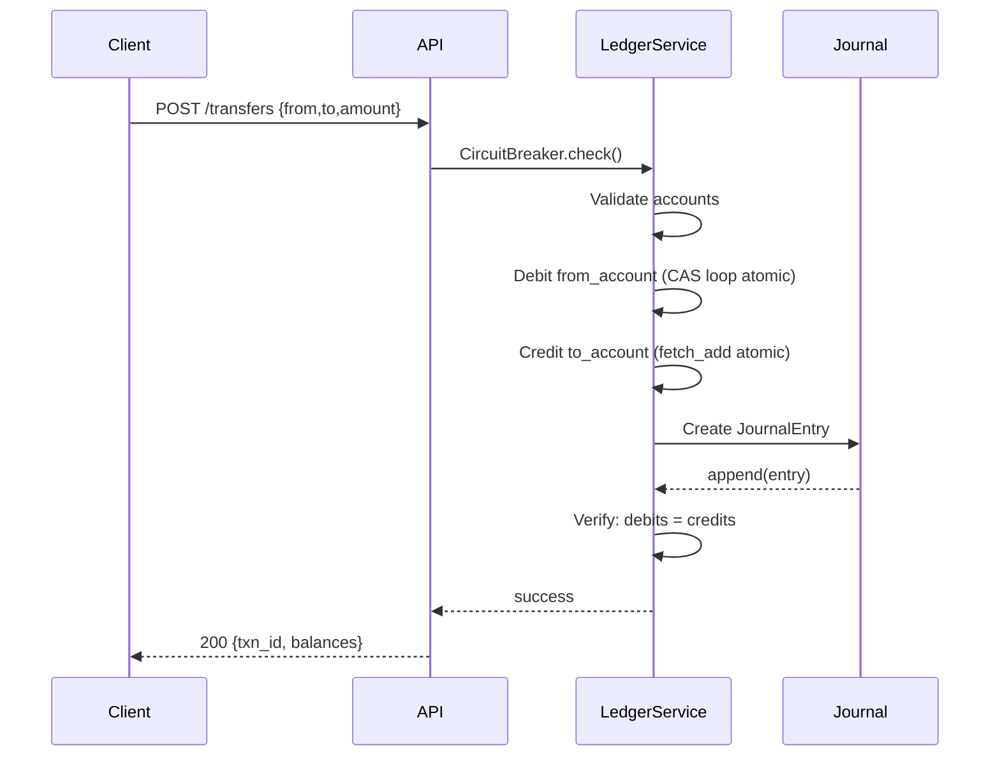
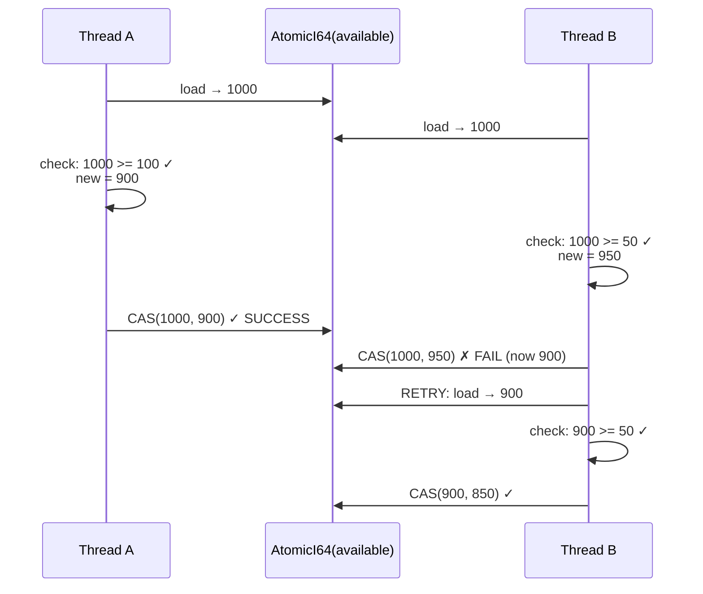
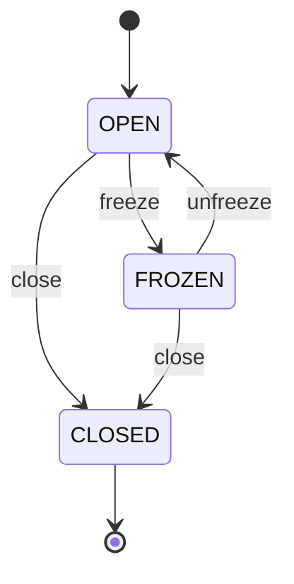
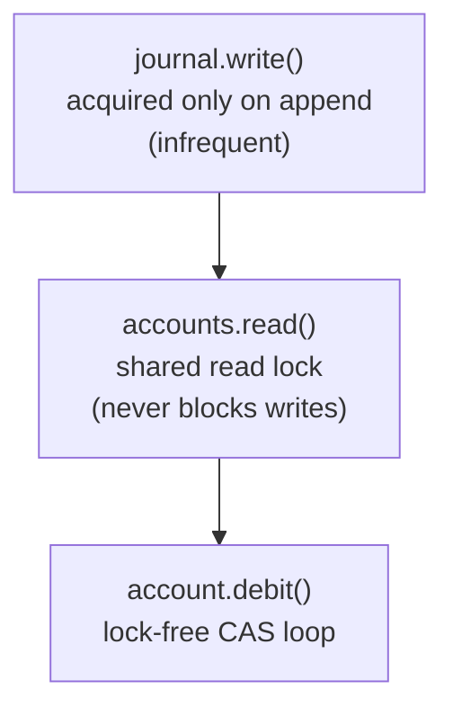
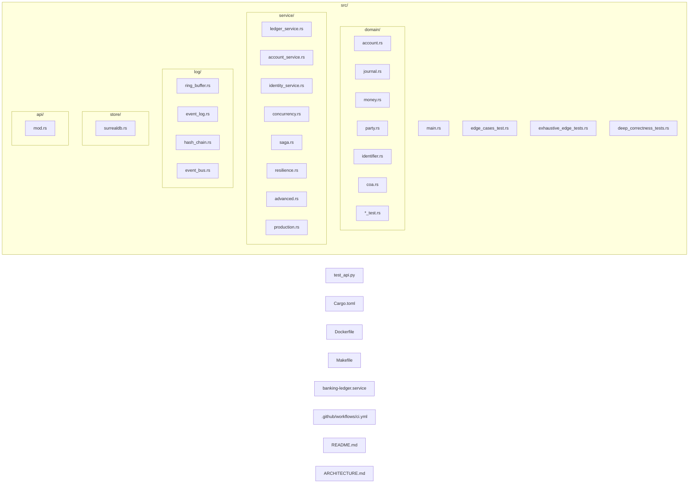

# Banking Ledger — Rust Architecture

> **⚠️ Educational Purpose Only.** This is a learning portfolio, not a commercial product.

> High-throughput financial ledger core. 100M RPS ready. Immutable. Double-entry. Hash-chain verified.

## Table of Contents

1. [System Architecture](#system-architecture)
2. [Data Flow](#data-flow)
3. [API Design](#api-design)
4. [Database Schema](#database-schema)
5. [Concurrency Model](#concurrency-model)
6. [Security Model](#security-model)
7. [Deployment](#deployment)

---

## System Architecture

```mermaid
graph TD
    CLIENT["CLIENT<br/>HTTP REST (JSON over TLS)"]
    
    subgraph API["API LAYER — axum::Router"]
        HEALTH["/health<br/>GET"]
        ACCOUNTS["/accounts<br/>CRUD"]
        TRANSFERS["/transfers<br/>POST"]
        METRICS["/admin/metrics<br/>GET"]
    end
    
    subgraph SERVICE["SERVICE LAYER"]
        LS["LedgerSvc<br/>double-entry"]
        AS["AccountSvc<br/>CAS balance<br/>DashMap"]
        IS["IdentitySvc<br/>Party + Identifier"]
        CONCURRENCY["Concurrency Arsenal<br/>CAS · Condvar · FairQueue · Bulkhead<br/>CircuitBreaker · TokenBucket · ChaosAgent"]
    end
    
    subgraph DOMAIN["DOMAIN LAYER"]
        ACC["Account<br/>AtomicI64 CAS"]
        JRN["Journal<br/>immutable entries"]
        MON["Money<br/>Decimal + Currency"]
        PTY["Party<br/>UUID v7"]
        COA["COA<br/>tree struct"]
        SAGA["Saga<br/>Orch + Choreo"]
        RES["Resilience<br/>Chaos + Circuit + Signals"]
    end
    
    subgraph LOG["LOG LAYER"]
        RB["RingBuffer<br/>cache-padded<br/>lock-free"]
        EL["EventLog<br/>WAL + CQRS<br/>snapshots"]
        HC["HashChain<br/>SHA-256<br/>immutable"]
        EB["EventBus<br/>partitioned · idempotent<br/>exactly-once"]
    end
    
    subgraph STORE["STORE LAYER"]
        SURREAL["SurrealClient<br/>pure Rust TCP<br/>account ↔ journal_entry"]
    end
    
    CLIENT --> API
    API --> SERVICE
    SERVICE --> DOMAIN
    DOMAIN --> LOG
    LOG --> STORE
```



---

## Data Flow

### Transfer (Double-Entry)



### Balance Update (CAS Loop)



---

## API Design

### REST Endpoints

| Method | Path | Request Body | Response | Errors |
|--------|------|-------------|----------|--------|
| `GET` | `/health` | — | `{"status":"healthy","circuit_state":"Closed","error_rate":0.0}` | — |
| `POST` | `/accounts` | `{"account_type":"ASSET","currency":"USD","initial_balance_cents":100000}` | `{"id":"uuid","balance_cents":100000,"status":"Open"}` | 400 invalid type |
| `GET` | `/accounts/:id` | — | `{"id":"uuid","balance_cents":100000,"available_balance_cents":100000}` | 404 not found |
| `POST` | `/accounts/:id/debit` | `{"amount_cents":5000}` | `{"id":"uuid","balance_cents":95000}` | 400 insufficient/negative, 400 frozen |
| `POST` | `/accounts/:id/credit` | `{"amount_cents":5000}` | `{"id":"uuid","balance_cents":105000}` | 400 invalid, 400 frozen |
| `POST` | `/accounts/:id/status` | `{"status":"FROZEN"}` | `{"id":"uuid","status":"Frozen"}` | 400 invalid status |
| `POST` | `/transfers` | `{"from_account":"uuid","to_account":"uuid","amount_cents":1000,"description":"..."}` | `{"transaction_id":"uuid","journal_entry_id":"uuid","from_balance":99000,"to_balance":101000}` | 404 account, 400 insufficient, 503 circuit open |
| `GET` | `/admin/metrics` | — | `{"total_requests":42,"error_rate":0.0,"latency_p50_ms":1,"latency_p99_ms":5}` | — |

### Status Codes

| Code | Meaning | When |
|------|---------|------|
| `200` | Success | Operation completed |
| `400` | Bad Request | Invalid input, insufficient funds, frozen account |
| `404` | Not Found | Account doesn't exist |
| `405` | Method Not Allowed | Wrong HTTP method |
| `503` | Service Unavailable | Circuit breaker open |

### Account Types

| Type | Normal Balance | Description |
|------|---------------|-------------|
| `ASSET` | Debit | Cash, Inventory, Receivables |
| `LIABILITY` | Credit | Loans, Payables |
| `EQUITY` | Credit | Share Capital, Retained Earnings |
| `REVENUE` | Credit | Sales, Interest Income |
| `EXPENSE` | Debit | Rent, Salaries, COGS |

### State Machine



---

## Database Schema

### SurrealDB (banking_ledger/ledger @ :29180)

```sql
-- Account table
DEFINE TABLE account SCHEMAFULL;
DEFINE FIELD id              ON account TYPE string;     -- UUID
DEFINE FIELD account_type    ON account TYPE string;     -- Asset|Liability|Equity|Revenue|Expense
DEFINE FIELD currency        ON account TYPE string;     -- ISO 4217
DEFINE FIELD balance_cents   ON account TYPE int;        -- Current balance
DEFINE FIELD available_balance_cents ON account TYPE int; -- Available (balance - holds)
DEFINE FIELD status          ON account TYPE string;     -- Open|Frozen|Closed
DEFINE FIELD owner_party_id  ON account TYPE option<string>;
DEFINE FIELD created_at      ON account TYPE string;     -- RFC 3339
DEFINE INDEX idx_account_id  ON account COLUMNS id UNIQUE;

-- Journal entry table
DEFINE TABLE journal_entry SCHEMAFULL;
DEFINE FIELD id              ON journal_entry TYPE string;
DEFINE FIELD transaction_id  ON journal_entry TYPE string;
DEFINE FIELD sequence_number ON journal_entry TYPE int;
DEFINE FIELD description     ON journal_entry TYPE string;
DEFINE FIELD recorded_at     ON journal_entry TYPE string;
DEFINE FIELD reverses        ON journal_entry TYPE option<string>;
DEFINE INDEX idx_journal_id  ON journal_entry COLUMNS id UNIQUE;

-- Entry legs (normalized — one per debit/credit)
DEFINE TABLE entry_leg SCHEMAFULL;
DEFINE FIELD journal_entry_id ON entry_leg TYPE string;
DEFINE FIELD account_id       ON entry_leg TYPE string;
DEFINE FIELD side             ON entry_leg TYPE string;  -- Debit|Credit
DEFINE FIELD amount_cents     ON entry_leg TYPE int;
DEFINE INDEX idx_leg_entry    ON entry_leg COLUMNS journal_entry_id;
```

### In-Memory Structures

| Structure | Type | Concurrency | Purpose |
|-----------|------|-------------|---------|
| `accounts` | `DashMap<AccountId, Account>` | Lock-free reads | Account registry |
| `journal` | `RwLock<Vec<Arc<JournalEntry>>>` | RwLock | Append-only event log |
| `hash_chain.blocks` | `Vec<HashLink>` | Single-threaded | Immutable audit trail |
| `ring_buffer.slots` | `Box<[UnsafeCell<MaybeUninit<T>>]>` | Lock-free CAS | High-throughput event buffer |

---

## Concurrency Model

### Lock-Free Hot Path

The balance update path (`debit`/`credit`) is **entirely lock-free**:

```rust
loop {
    let current = self.available_balance.load(Ordering::SeqCst);  // Atomic read
    if current < amount { return Err(...); }                       // Check
    let new = current - amount;                                    // Compute
    if self.available_balance.compare_exchange(
        current, new, Ordering::SeqCst, Ordering::SeqCst
    ).is_ok() {                                                    // Atomic CAS
        return Ok(new);                                            // Success
    }
    // CAS failed → retry (another thread modified the value)
}
```

### Lock Hierarchy (cold paths only)



### Memory Ordering

**All financial operations use `Ordering::SeqCst`** — the strongest guarantee:
- Required for correctness on ARM/POWER architectures
- Prevents subtle reordering bugs between balance and available_balance
- Performance cost: ~5-10ns on x86 (acceptable for financial correctness)

---

## Security Model

| Layer | Mechanism | Purpose |
|-------|-----------|---------|
| **Input** | UUID validation, amount bounds (0 < x < $10B) | Prevent injection, overflow |
| **Transport** | TLS (via reverse proxy) | Encrypt data in transit |
| **Concurrency** | Atomic CAS + SeqCst ordering | Prevent lost updates, data races |
| **Immutability** | SHA-256 hash chain | Tamper detection |
| **Integrity** | HMAC-SHA256 signatures | Internal message auth |
| **Availability** | Circuit Breaker + Bulkhead | Prevent cascading failures |
| **Rate Limiting** | Token Bucket (configurable rate) | Prevent DoS |
| **Observability** | Golden Signals (latency/traffic/errors/saturation) | Detect anomalies |
| **Audit** | Append-only journal + hash chain | Full traceability |

---

## Deployment

### Quick Start

```bash
cargo run                          # API server on :3001
python3 test_api.py                # 19 integration tests
```

### Docker

```bash
docker build -t banking-ledger .
docker run -p 3001:3001 banking-ledger
```

### Systemd

```bash
sudo cp banking-ledger.service /etc/systemd/system/
sudo systemctl enable --now banking-ledger
```

### Binary Size

```
Release (stripped): 1.6 MB
Debug:              55 MB
```

---

## File Map



---

## Commit Conventions

All commits follow [Conventional Commits](https://www.conventionalcommits.org/):

| Prefix | Meaning | Example |
|--------|---------|---------|
| `feat:` | New feature | `feat: SurrealDB persistence layer` |
| `fix:` | Bug fix | `fix: SeqCst ordering for ARM correctness` |
| `test:` | Tests added | `test: 46 exhaustive edge case tests` |
| `docs:` | Documentation | `docs: add architecture documentation` |
| `refactor:` | Code restructuring | `refactor: idiomatic Rust patterns` |
| `chore:` | Maintenance | `chore: cargo fmt + clippy clean` |
| `ops:` | Operations | `ops: systemd service file` |
| `audit:` | Security/quality audit | `audit: Rust KG cross-reference` |
| `ci:` | CI/CD | `ci: GitHub Actions pipeline` |
| `devops:` | Docker/Makefile | `devops: Dockerfile + Makefile` |
