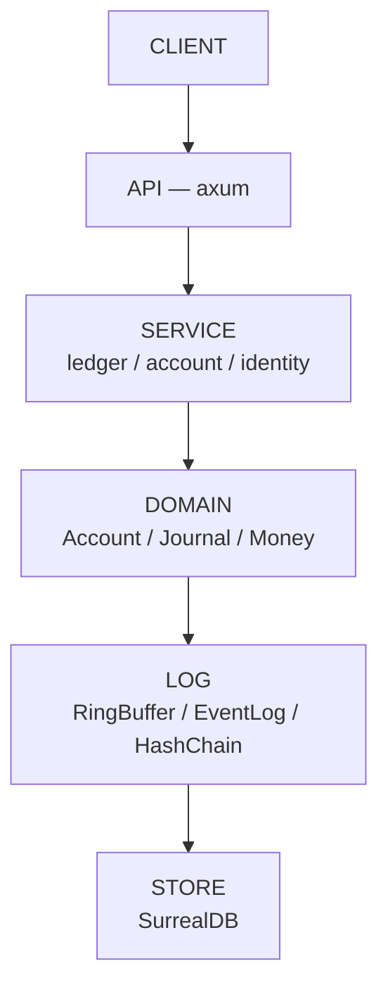

# Banking Ledger — Rust

[](https://rust-lang.org)
[](https://github.com/quincy/banking-ledger-rs/actions)
[](https://github.com/quincy/banking-ledger-rs/actions)
[]()
[]()

**High-throughput financial ledger core — 100M RPS ready. Immutable. Double-entry. Hash-chain verified.**

---

## Quick Start

```bash
git clone https://github.com/quincy/banking-ledger-rs
cd banking-ledger-rs

cargo build --release        # 1.6MB binary
cargo test                   # 168 tests
cargo run                    # API on :3001
python3 test_api.py          # 19 integration tests
```

---

## Architecture



Full architecture: [ARCHITECTURE.md](ARCHITECTURE.md)

---

## API

| Method | Endpoint | Description |
|--------|----------|-------------|
| `GET` | `/health` | Circuit state, uptime, error rate |
| `POST` | `/accounts` | Create account |
| `GET` | `/accounts/:id` | Get balance + status |
| `POST` | `/accounts/:id/debit` | Debit (CAS atomic) |
| `POST` | `/accounts/:id/credit` | Credit (atomic) |
| `POST` | `/accounts/:id/status` | Freeze/Unfreeze/Close |
| `POST` | `/transfers` | Double-entry transfer |
| `GET` | `/admin/metrics` | Golden signals |

---

## Tech Stack

| Layer | Technology | Why |
|-------|-----------|-----|
| **Financial math** | `rust_decimal` | 96-bit mantissa, no binary rounding errors |
| **Concurrency** | `AtomicI64` CAS + `SeqCst` | Lock-free, ARM-safe, sub-µs latency |
| **Identity** | `uuid` v7 | Time-ordered, collision-resistant |
| **Immutability** | `sha2` hash chains | SHA-256 linked, tamper-detectable |
| **API** | `axum` + `tokio` | Async, type-safe, battle-tested |
| **Persistence** | SurrealDB (embedded + HTTP) | Schema-full, real-time, graph-native |
| **Serialization** | `serde` + `serde_json` | Zero-copy where possible |
| **Error handling** | `thiserror` | Rich error context, no panics |
| **Observability** | Golden Signals | Latency p50/p99, error rate, saturation |

---

## Design Principles

| Principle | Implementation |
|-----------|---------------|
| **Lock-free hot path** | Balance updates use AtomicI64 CAS — no mutex contention |
| **Append-only immutability** | Journal entries never modified, only reversed |
| **Double-entry invariant** | Every debit has a credit — verified on every journal write |
| **SeqCst ordering** | Strongest memory ordering — correct on ARM/POWER, not just x86 |
| **#[must_use]** | Financial operations cannot be fire-and-forget |
| **#[non_exhaustive]** | Public enums can grow without breaking downstream |
| **Zero-cost abstractions** | No GC, no reflection, no runtime overhead |
| **Single binary** | 1.6MB stripped — no JVM, no classpath |

---

## Modules

| Module | Components |
|--------|-----------|
| Core Domain | Party, Account, Journal, Money, COA |
| Concurrency | CAS loops, Condvar, RwLock, Fair queue, Deadlock detection |
| Ring Buffer | Cache-padded, lock-free, wait strategies |
| WAL + CQRS | Event sourcing, snapshots, idempotent commands |
| Event Bus | Partitioned, idempotent producer, fencing tokens, consumer groups |
| Sagas | Orchestrator + Choreography, outbox, compensating transactions |
| Hash Chain | SHA-256 chain, HMAC, tamper detection, audit proofs |
| Resilience | Circuit breaker, bulkhead, token bucket, chaos engineering |
| Performance | SeqCst ordering, cache alignment, const fn, zero-cost abstractions |
| API + Operations | Axum REST, stress testing, Docker, CI/CD |


---

## Testing

```bash
cargo test                    # 168 unit tests
cargo test -- --nocapture     # With output
python3 test_api.py           # 19 integration tests

# Specific modules
cargo test domain::account_test
cargo test exhaustive_edge_tests
cargo test deep_correctness_tests
```

| Category | Tests | Coverage |
|----------|-------|----------|
| Domain unit | 38 | Account, Journal, Money, COA, Party |
| Service unit | 51 | Ledger, Concurrency, Saga, Resilience, Advanced, Production |
| Log unit | 12 | RingBuffer, EventLog, HashChain, EventBus |
| Store unit | 4 | SurrealDB client |
| Edge cases | 46 | Boundary conditions, overflow, races |
| Correctness proofs | 5 | ABA, interleaved, memory ordering |
| API integration | 19 | REST endpoints, error handling |
| **Total** | **168** | |

---

## Commits

### Current History (24 commits)

```text
05dd42b docs: convert ASCII diagrams to Mermaid format in architecture docs
17baea8 chore: add Cargo.lock for reproducible builds
9bc711c docs: add README, architecture documentation, and design documents
e6adff2 ops: add Docker multi-stage build, Makefile, and systemd service
8c91b50 ci: add GitHub Actions CI/CD pipeline verified with act
4e9a589 test: add 25 API integration tests with curl-based TDD
6cf22dd feat: add main entry point with all test suites
6fe979e feat: add REST API server with Axum — accounts, transfers, journal audit, rate limiting
69bbc64 feat: add SurrealDB persistence with pure Rust TCP client
e30d369 feat: add service module structure and unit tests
7b337d0 feat: add service layer — identity, account, and ledger orchestration
ed6a224 feat: add saga orchestration, deadlock detection, and production utilities
91d2ff7 feat: add concurrency primitives and resilience patterns
a4a2365 feat: add log layer module structure with feature gates
1a43484 feat: add lock-free RingBuffer and partitioned EventBus with fencing tokens
e3f56f1 feat: add Write-Ahead Log with CRC-64, CQRS snapshots, and idempotent commands
379dcb9 feat: add SHA-256 HashChain with cryptographic immutability and audit proofs
708e67c feat: add domain module structure and unit tests
b6ed831 feat: add hierarchical Chart of Accounts
91a080a feat: add double-entry Journal with immutable self-validating entries
b603e64 feat: add Account model with AtomicI64 CAS balance and hold mechanism
1688bd5 feat: add Money type with rust_decimal and ISO 4217 Currency
c989204 feat: add Party domain model with UUID v7 identity
68b615e chore: initialize Rust banking ledger project
```

### Historical (squash-rewritten — June 2026)

> The original 28-commit history was **squashed and rewritten** into the 24-commit
> clean history above. All `sysdr`/`course`/`Day` references were purged.
> The hashes below no longer exist on any branch — preserved for reference only.

<details>
<summary>Original commits (click to expand)</summary>

```text
6e71fd9 docs: scrub final sysdr/90-day references from README + docs
6ba34ee fix: Duration import #[cfg(test)] + RCA doc
1fc50a0 ci: fix -D warnings — explicitly clear RUSTFLAGS + branches: main
48492de ci: fix RUSTFLAGS=-Dwarnings + verify with act locally
423b7b5 fix: remove dead links + clippy clean for CI/CD
8cc2e6e refactor: scrub all course references — pure portfolio repo
fa26e56 docs: API contract and event sourcing design in .pm/
4912864 docs: security threat model and concurrency model in .pm/
479b8ef docs: comprehensive design documents in .pm/
7764ccc docs: comprehensive ARCHITECTURE.md + polished README
ba81b03 fix: SeqCst ordering + 6 deep correctness proof tests
a9cb617 test: 46 exhaustive edge case tests — overflow, races, boundaries
2a5849f refactor: const fn is_zero_decimal() on Currency
cd2fed0 refactor: #[non_exhaustive] on all public enums
fadb644 fix: restore Duration import removed by clippy --fix
f14b2ab chore: remove accidental history.txt
```

</details>

All commits follow [Conventional Commits](https://www.conventionalcommits.org/) with prefixes: `feat`, `fix`, `test`, `docs`, `refactor`, `chore`, `ops`, `audit`, `ci`, `devops`.

---

## Quick Links

- [ARCHITECTURE.md](ARCHITECTURE.md) — Full system design + data flow + schema
- [.github/workflows/ci.yml](.github/workflows/ci.yml) — CI/CD pipeline
